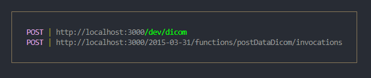

# Serverless - AWS Node.js Typescript

This project has been generated using the `aws-nodejs-typescript` template from the [Serverless framework](https://www.serverless.com/).

For detailed instructions, please refer to the [documentation](https://www.serverless.com/framework/docs/providers/aws/).

## Installation/deployment instructions

Depending on your preferred package manager, follow the instructions below to deploy your project.

> **Requirements**: NodeJS `lts/fermium (v.14.15.0)`. If you're using [nvm](https://github.com/nvm-sh/nvm), run `nvm use` to ensure you're using the same Node version in local and in your lambda's runtime.

### Using NPM

- Run `npm i` to install the project dependencies
- Run `npx sls dynamodb install` to install database locally
- Run `npx sls offline start` to run locally
- Run `npx sls deploy` to deploy this stack to AWS

### Using Yarn

- Run `yarn` to install the project dependencies
- Run `yarn sls dynamodb install` to install database locally
- Run `yarn sls offline start` to run locally
- Run `yarn sls deploy` to deploy this stack to AWS

Your terminal should have this output:
 

## The project

This project contains a single lambda function triggered by an HTTP request made on the provisioned API Gateway REST API `/dicom` route with `POST` method. A dicom file (example in the resources folder) must be sent in the body of this application. To do this, send a file in form-data format.

- requesting any other path than `/dicom` with any other method than `POST` will result in API Gateway returning a `404` HTTP error code
- sending a `POST` request to `/dicom` with a payload **not** containing a dicom file will result in API Gateway returning a `500` HTTP error code
- sending a `POST` request to `/dicom` with a payload containing a file dicom (new or updated) will result in API Gateway returning a `201` HTTP status code with a message saluting the provided name and the detailed event processed by the lambda
- sending a `POST` request to `/dicom` with a payload containing a file dicom that alredy exists will result in API Gateway returning a `403` HTTP error code


> :warning: As is, this template, once deployed, opens a **public** endpoint within your AWS account resources. Anybody with the URL can actively execute the API Gateway endpoint and the corresponding lambda. You should protect this endpoint with the authentication method of your choice.

### Locally (TODO)

In order to test the hello function locally, run the following command:

- `npx sls invoke --function postDataDicom --path src/functions/dicom/mock.json` if you're using NPM
- `yarn sls invoke --function postDataDicom --path src/functions/dicom/mock.json` if you're using Yarn

Check the [sls invoke local command documentation](https://www.serverless.com/framework/docs/providers/aws/cli-reference/invoke-local/) for more information.

### Remotely

Copy and replace your `url` - found in Serverless `deploy` command output - and `name` parameter in the following `curl` command in your terminal or in Postman to test your newly deployed application, in my case, this:

```
curl --location --request POST 'https://i6bnu3l5fd.execute-api.us-east-1.amazonaws.com/dev/dicom' \
--form '=@"/C:/Users/iohar/Downloads/insercao.dcm"'

```

## Template features

### Project structure

The project code base is mainly located within the `src` folder. This folder is divided in:

- `functions` - containing code base and configuration for your lambda functions
- `libs` - containing shared code base between your lambdas

```
.
├── src
│   ├── functions               # Lambda configuration and source code folder
│   │   └── dicom
│   │      ├── handler.ts       # `postDataDicom` lambda source code
│   │      ├── index.ts         # `postDataDicom` lambda Serverless configuration
│   │      └── mock.json        # `postDataDicom` lambda input parameter, if any, for local invocation
│   │
│   ├── libs                    # Lambda shared code
│   │   ├── apiGateway.ts       # API Gateway specific helpers
│   │   ├── handlerResolver.ts  # Sharable library for resolving lambda handlers
│   │   └── lambda.ts           # Lambda middleware
│   ├── models                  # Database configuration and source code folder
│   │   ├── Dicom.ts            # Interface dicom
│   │   └── index.ts            # Database configuration
│   └── services                # Service configuration and source code folder
│       ├── DicomService.ts     # Dicom service
│       └── index.ts            # Create client database
├── package.json
├── serverless.ts               # Serverless service file
├── tsconfig.json               # Typescript compiler configuration
├── tsconfig.paths.json         # Typescript paths
└── webpack.config.js           # Webpack configuration
```

### 3rd party libraries

- [json-schema-to-ts](https://github.com/ThomasAribart/json-schema-to-ts) - uses JSON-Schema definitions used by API Gateway for HTTP request validation to statically generate TypeScript types in your lambda's handler code base
- [middy](https://github.com/middyjs/middy) - middleware engine for Node.Js lambda. This template uses [http-json-body-parser](https://github.com/middyjs/middy/tree/master/packages/http-json-body-parser) to convert API Gateway `event.body` property, originally passed as a stringified JSON, to its corresponding parsed object
- [@serverless/typescript](https://github.com/serverless/typescript) - provides up-to-date TypeScript definitions for your `serverless.ts` service file

### Advanced usage

Any tsconfig.json can be used, but if you do, set the environment variable `TS_NODE_CONFIG` for building the application, eg `TS_NODE_CONFIG=./tsconfig.app.json npx serverless webpack`
